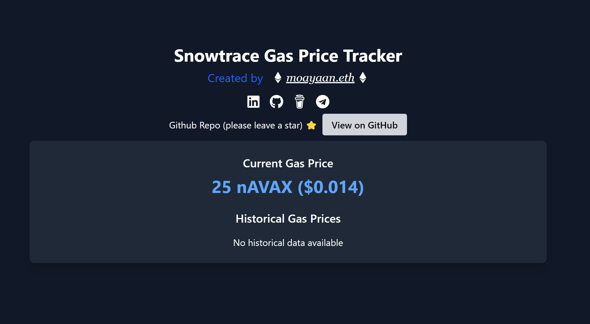

<!-- @format -->

# Snowtrace Gas Price Tracker

A real-time tracker for Avalanche (AVAX) gas prices using data from Snowtrace. This project consists of a backend service that scrapes gas prices and a frontend application that displays the data.

Snowtrace Gas Price Tracker Demo

## Deployed Links

- 🖥️ Backend:https://snowtrace-scraping.onrender.com
- 🌐 Frontend:https://snowtrace-scraping1.onrender.com

## Tech Stack

### Backend

- 🚀 Node.js - JavaScript runtime built on Chrome's V8 JavaScript engine
- 🛠️ Express - Fast, unopinionated, minimalist web framework for Node.js
- 🍃 MongoDB - Document-based, distributed database
- 🕷️ Cheerio - Fast, flexible & lean implementation of core jQuery for server-side scraping
- 🔄 Axios - Promise based HTTP client for the browser and Node.js
- ⏱️ node-cron - Task scheduler in pure JavaScript for node.js

### Frontend

- ⚛️ React - JavaScript library for building user interfaces
- 🏗️ TypeScript - Typed superset of JavaScript
- 🎨 Tailwind CSS - Utility-first CSS framework
- 📊 Recharts - Composable charting library for React
- 🔄 Axios - Promise-based HTTP client
- 🍞 React Hot Toast - Lightweight toast notifications
- 📅 date-fns - Modern JavaScript date utility library
- ⚡ Vite - Next generation frontend tooling
